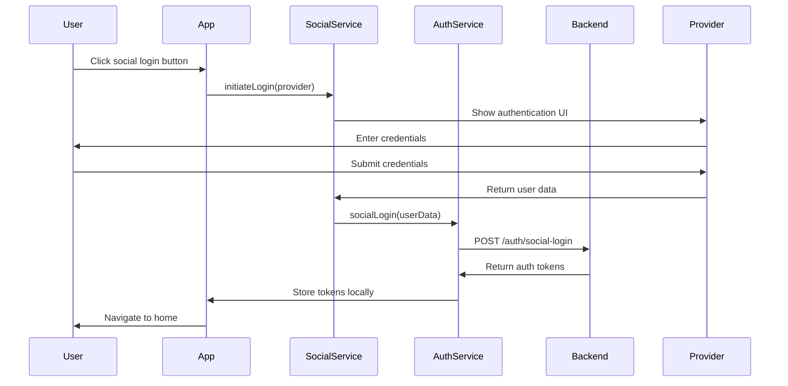
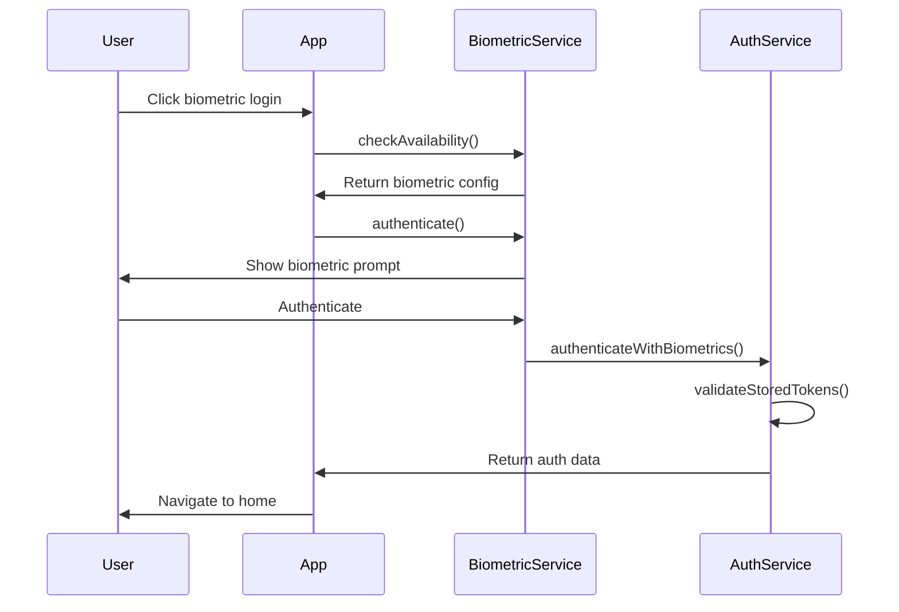

# Social Authentication Documentation

## Overview

The Myntra Clone mobile app supports multiple social authentication methods to provide users with convenient and secure login options. This document covers the implementation, configuration, and usage of social authentication features.

## Supported Social Providers

### 1. Google Sign-In
- **Package**: `@react-native-google-signin/google-signin`
- **Version**: ^10.1.0
- **Features**:
  - OAuth 2.0 authentication
  - Profile information access (email, name, photo)
  - Token refresh capabilities
  - Offline access support

### 2. Facebook Login
- **Package**: `react-native-fbsdk-next`
- **Version**: ^12.1.0
- **Features**:
  - Facebook SDK integration
  - Profile data access
  - Email permissions
  - Profile photo access

### 3. Apple Sign-In
- **Package**: `@invertase/react-native-apple-authentication`
- **Version**: ^2.2.2
- **Features**:
  - Native iOS Apple ID authentication
  - Email and name access
  - Anti-fraud protection
  - Platform-specific implementation (iOS only)

### 4. Biometric Authentication
- **Package**: `react-native-biometrics`
- **Version**: ^3.0.1
- **Features**:
  - Fingerprint authentication
  - Face ID support
  - Device credentials fallback
  - Secure key storage

## Setup and Configuration

### Google Sign-In Setup

1. **Google Cloud Console Configuration**:
   ```
   1. Create a new project in Google Cloud Console
   2. Enable Google Sign-In API
   3. Create OAuth 2.0 Client IDs for:
      - Android (using package name and SHA-1)
      - iOS (using bundle identifier)
   4. Download configuration file
   ```

2. **Environment Variables**:
   ```bash
   GOOGLE_WEB_CLIENT_ID=your_web_client_id
   GOOGLE_IOS_CLIENT_ID=your_ios_client_id
   GOOGLE_ANDROID_CLIENT_ID=your_android_client_id
   ```

3. **iOS Configuration**:
   - Add `GoogleService-Info.plist` to iOS project
   - Update `Info.plist` with URL schemes
   - Configure reverse client ID

4. **Android Configuration**:
   - Add `google-services.json` to `android/app/`
   - Update `build.gradle` with Google Sign-In dependencies
   - Configure SHA-1 and SHA-256 fingerprints

### Facebook Login Setup

1. **Facebook Developer Console**:
   ```
   1. Create a new app
   2. Add Facebook Login product
   3. Configure platforms (iOS/Android)
   4. Set OAuth redirect URIs
   5. Generate App ID and App Secret
   ```

2. **Environment Variables**:
   ```bash
   FACEBOOK_APP_ID=your_facebook_app_id
   FACEBOOK_APP_NAME=your_facebook_app_name
   ```

3. **iOS Configuration**:
   - Update `Info.plist` with Facebook App ID
   - Add URL scheme handler
   - Configure Apple Transport Security

4. **Android Configuration**:
   - Add Facebook App ID to `strings.xml`
   - Configure Facebook SDK in `MainActivity.java`
   - Add internet permission to manifest

### Apple Sign-In Setup

1. **Apple Developer Console**:
   ```
   1. Create App ID with Sign In capability
   2. Configure Services ID for authentication
   3. Generate and download private key
   4. Set up team and bundle identifiers
   ```

2. **Environment Variables**:
   ```bash
   APPLE_BUNDLE_ID=com.yourcompany.myntraclone
   APPLE_TEAM_ID=your_developer_team_id
   ```

3. **iOS Configuration**:
   - Add Sign In capability to Xcode project
   - Update `Info.plist` with Services ID
   - Configure associated domains

## Implementation Details

### Service Architecture

The social authentication system follows a modular architecture:

```
src/services/
├── googleAuthService.ts     # Google OAuth implementation
├── facebookAuthService.ts   # Facebook SDK integration
├── appleAuthService.ts      # Apple Sign-In implementation
├── biometricService.ts    # Biometric authentication
└── authService.ts         # Main authentication service
```

### Core Components

#### 1. SocialLoginButtons
```typescript
interface SocialLoginButtonsProps {
  onSuccess?: () => void;
  onError?: (error: string) => void;
}
```

**Features**:
- Provider availability detection
- Loading state management
- Error handling and user feedback
- Platform-specific button rendering

#### 2. BiometricLoginButton
```typescript
interface BiometricLoginButtonProps {
  onSuccess?: () => void;
  onError?: (error: string) => void;
  style?: ViewStyle;
}
```

**Features**:
- Biometric type detection (Face ID, Touch ID, Fingerprint)
- Enrollment management
- Authentication prompts
- Secure credential storage

### Authentication Flow

#### 1. Social Login Flow


#### 2. Biometric Login Flow


## Usage Examples

### Basic Social Login
```typescript
import SocialLoginButtons from '../components/SocialLoginButtons';

const LoginScreen = () => {
  const handleSocialSuccess = () => {
    // User successfully authenticated
    // Navigation handled by Redux state change
  };

  const handleSocialError = (error: string) => {
    console.error('Social login failed:', error);
  };

  return (
    <SocialLoginButtons
      onSuccess={handleSocialSuccess}
      onError={handleSocialError}
    />
  );
};
```

### Biometric Authentication
```typescript
import BiometricLoginButton from '../components/BiometricLoginButton';

const LoginScreen = () => {
  const handleBiometricSuccess = () => {
    // Biometric authentication successful
  };

  const handleBiometricError = (error: string) => {
    console.error('Biometric login failed:', error);
  };

  return (
    <BiometricLoginButton
      onSuccess={handleBiometricSuccess}
      onError={handleBiometricError}
    />
  );
};
```

### Service Integration
```typescript
import authService from '../services/authService';

// Login with Google
try {
  const userData = await authService.loginWithGoogle();
  console.log('User logged in:', userData);
} catch (error) {
  console.error('Google login failed:', error);
}

// Enable biometric login
const biometricEnabled = await authService.enableBiometricLogin();
if (biometricEnabled) {
  console.log('Biometric login enabled');
}

// Authenticate with biometrics
try {
  const authData = await authService.authenticateWithBiometrics();
  if (authData) {
    console.log('Biometric auth successful:', authData);
  }
} catch (error) {
  console.error('Biometric auth failed:', error);
}
```

## Error Handling

### Common Error Codes

#### Google Sign-In Errors
- `SIGN_IN_CANCELLED`: User cancelled sign-in
- `IN_PROGRESS`: Sign-in already in progress
- `PLAY_SERVICES_NOT_AVAILABLE`: Google Play Services unavailable

#### Facebook Login Errors
- Network connectivity issues
- Permission denial by user
- Invalid app configuration

#### Apple Sign-In Errors
- `1000`: User cancelled operation
- `500`: Internal error occurred
- `1004`: Invalid response from Apple

#### Biometric Errors
- `NOT_AVAILABLE`: Biometric hardware not available
- `NOT_ENROLLED`: No biometric credentials enrolled
- `AUTHENTICATION_FAILED`: Authentication attempt failed

### Error Handling Best Practices

1. **User-Friendly Messages**:
   ```typescript
   const getErrorMessage = (error: any, provider: string): string => {
     if (error.code === 'SIGN_IN_CANCELLED') {
       return `${provider} login was cancelled`;
     }
     return error.message || `${provider} login failed`;
   };
   ```

2. **Graceful Degradation**:
   ```typescript
   // Fallback to email/password if social login fails
   const handleSocialLoginError = (error: string) => {
     Toast.show({
       type: 'error',
       text1: error
     });
     // Show manual login option
     setShowManualLogin(true);
   };
   ```

3. **Retry Logic**:
   ```typescript
   const retrySocialLogin = async (provider: string, maxRetries = 3) => {
     for (let i = 0; i < maxRetries; i++) {
       try {
         return await authService.loginWithProvider(provider);
       } catch (error) {
         if (i === maxRetries - 1) throw error;
         await new Promise(resolve => setTimeout(resolve, 1000 * i));
       }
     }
   };
   };
   ```

## Security Considerations

### Token Management
1. **Secure Storage**:
   - Use AsyncStorage for token persistence
   - Implement automatic token refresh
   - Handle token expiration gracefully

2. **Biometric Security**:
   - Secure key generation and storage
   - Device credential verification
   - Anti-tampering measures

### Data Privacy
1. **Minimal Data Collection**:
   - Only request necessary permissions
   - Implement privacy policy compliance
   - Allow user consent management

2. **Data Protection**:
   - Secure transmission with HTTPS
   - Client-side data encryption
   - Compliance with GDPR/CCPA

## Testing

### Unit Testing
```typescript
// Example test for Google Auth Service
describe('GoogleAuthService', () => {
  it('should successfully authenticate user', async () => {
    const mockUser = {
      id: 'test-id',
      email: 'test@example.com',
      name: 'Test User'
    };

    jest.spyOn(GoogleSignin, 'signIn').mockResolvedValue(mockUser);

    const result = await googleAuthService.signIn();
    expect(result).toEqual(mockUser);
  });

  it('should handle cancellation gracefully', async () => {
    jest.spyOn(GoogleSignin, 'signIn').mockRejectedValue({
      code: 'SIGN_IN_CANCELLED'
    });

    await expect(googleAuthService.signIn()).rejects.toThrow('Sign in was cancelled');
  });
});
```

### Integration Testing
```typescript
// Example E2E test for social login flow
describe('Social Login Flow', () => {
  it('should complete Google login flow', async () => {
    await element(by.id('google-login-button')).tap();
    await element(by.text('Continue with Google')).tap();

    // Wait for navigation to home screen
    await waitFor(element(by.id('home-screen')));
    expect(element(by.id('home-screen'))).toBeVisible();
  });
});
```

## Troubleshooting

### Common Issues

#### 1. Google Sign-In Issues
- **Problem**: SHA-1 fingerprint mismatch
- **Solution**:
  - Run `keytool -list -v -keystore ~/.android/debug.keystore`
  - Update Google Cloud Console with correct SHA-1

#### 2. Facebook Login Issues
- **Problem**: Invalid hash key
- **Solution**:
  - Generate debug key hash: `keytool -exportcert -alias androiddebugkey -keystore ~/.android/debug.keystore | openssl sha1 -binary | openssl base64`
  - Update Facebook Developer Console

#### 3. Apple Sign-In Issues
- **Problem**: Invalid Services ID
- **Solution**:
  - Verify bundle identifier matches App ID
  - Check Services ID configuration
  - Ensure developer team is correct

#### 4. Biometric Issues
- **Problem**: Biometric not available
- **Solution**:
  - Check device hardware support
  - Verify biometric enrollment
  - Test on physical device

### Debug Mode

Enable debug logging:
```typescript
// Enable debug mode in development
if (__DEV__) {
  console.log('Social Auth Debug:', {
    googleConfig: GoogleSignin.configure(),
    biometricConfig: await biometricService.isAvailable()
  });
}
```

## Performance Optimization

### Initialization
- Lazy load social SDKs
- Cache authentication tokens
- Implement connection pooling

### User Experience
- Show loading states immediately
- Provide clear error messages
- Implement progressive loading

## Best Practices

### Development
1. **Environment Management**:
   - Use different client IDs for development/production
   - Implement environment variable validation
   - Use certificate pinning

2. **Code Organization**:
   - Separate service implementations
   - Implement consistent error handling
   - Use TypeScript for type safety

### Production
1. **Security**:
   - Regular security audits
   - Dependency vulnerability scanning
   - Secure credential management

2. **Monitoring**:
   - Authentication success/failure rates
   - Performance metrics
   - User experience analytics

## Future Enhancements

### Planned Features
1. **Additional Providers**:
   - Twitter integration
   - LinkedIn authentication
   - Microsoft Account login

2. **Advanced Features**:
   - Social account linking
   - Progressive authentication
   - Multi-factor authentication support

3. **User Experience**:
   - One-tap authentication
   - Smart authentication suggestions
   - Cross-device synchronization

## Support and Maintenance

### Regular Updates
- Update SDK dependencies regularly
- Monitor for breaking changes
- Test on new OS versions

### Security Maintenance
- Regular dependency audits
- Monitor security advisories
- Update security configurations

---

## API Reference

### AuthService Methods

| Method | Description | Parameters | Returns |
|---------|-------------|------------|---------|
| `loginWithGoogle()` | Authenticate with Google | none | Promise<AuthResponse> |
| `loginWithFacebook()` | Authenticate with Facebook | none | Promise<AuthResponse> |
| `loginWithApple()` | Authenticate with Apple | none | Promise<AuthResponse> |
| `enableBiometricLogin()` | Enable biometric auth | none | Promise<boolean> |
| `authenticateWithBiometrics()` | Auth with biometrics | none | Promise<AuthResponse|null> |

### Service Configurations

```typescript
interface SocialAuthConfig {
  google: {
    clientId: string;
    webClientId: string;
    isConfigured: boolean;
  };
  facebook: {
    appId: string;
    isConfigured: boolean;
  };
  apple: {
    isConfigured: boolean;
    isSupported: boolean;
  };
}
```

This documentation provides comprehensive guidance for implementing and maintaining social authentication in the Myntra Clone mobile application.